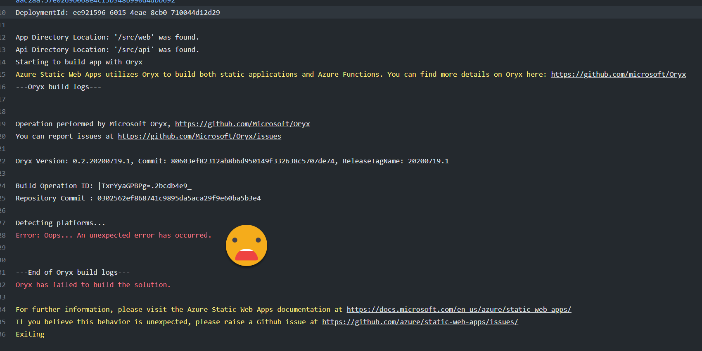

# azure-static-web-app-hugo-build-fail
This repo demonstrates Oryx build failures for hugo caused by hugo configuration.

## Background

When using Azure Static Web Apps with Hugo on several occasions we found themes and configuration that would cause
builds to fail with an "Oops - something went wrong error".

These themes worked fine for HUGO when building and running locally and the config.toml passed TOML validation checks.

We discovered that the order of sections and naming in the correct scenerio will cause the above error during a build, being thrown by Oryx.

### The Issue

Oryx throw an error after or during "Detecting platforms..." when a "sub-section" is defined before the "root" section.  

    [params.search]
     enable = true

    [params]
     author = "my name"

However the following works successfully:

    [params]
     author = "my name" 

    [params.search]
     enable = true

### Secondary Consideration

We should have a better error in this situation then "Oops - an unexpected error has occured". 

## To Reproduce

Use the current repo with an Azure Static Web App using the existing config.toml.  To resolve the issue use replace with config-working.toml (rename or replace contents of config.toml).
